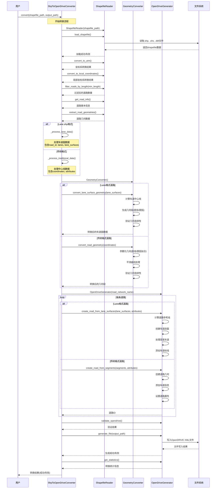
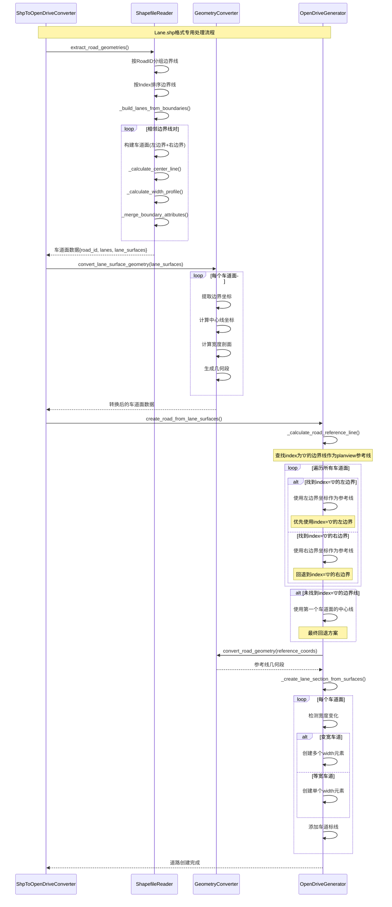
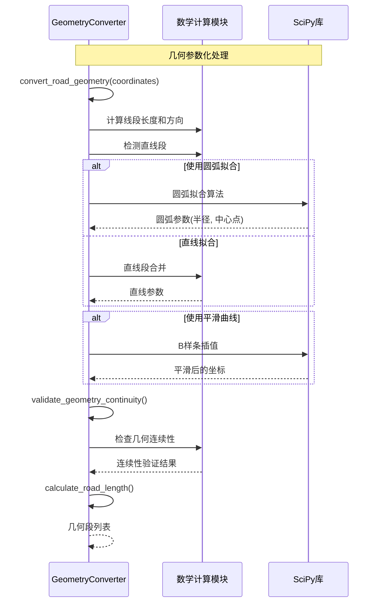
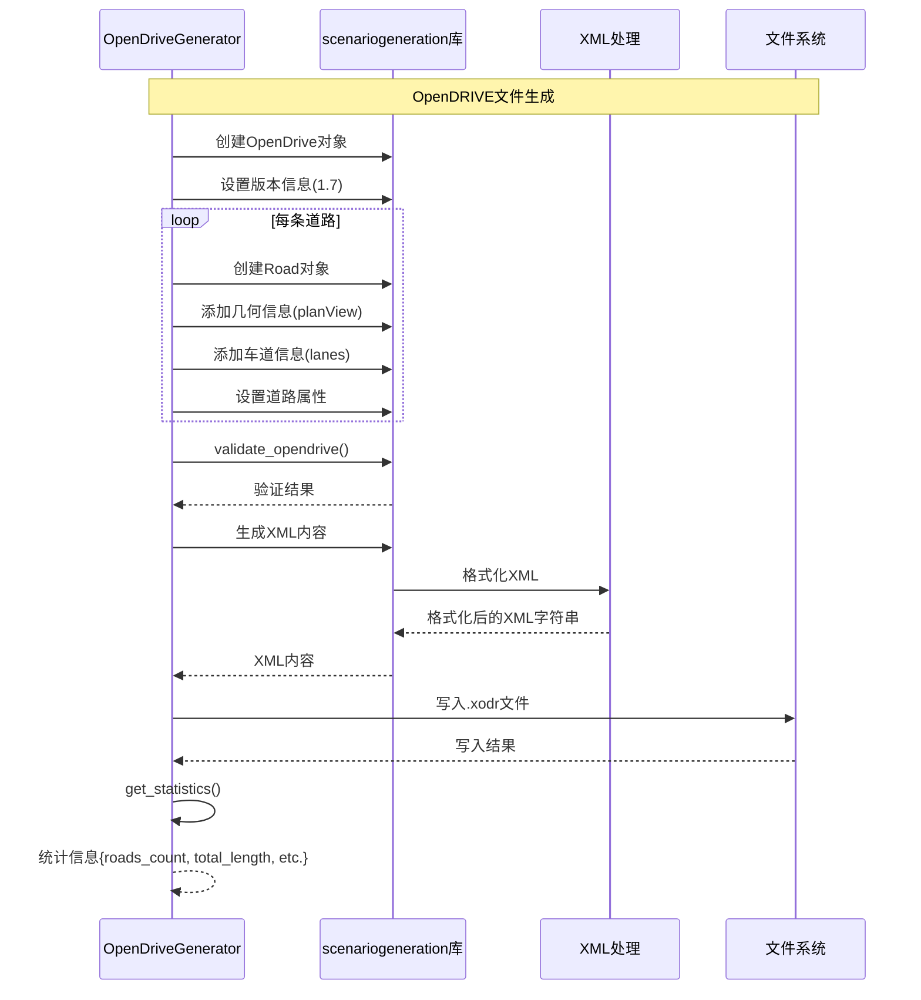
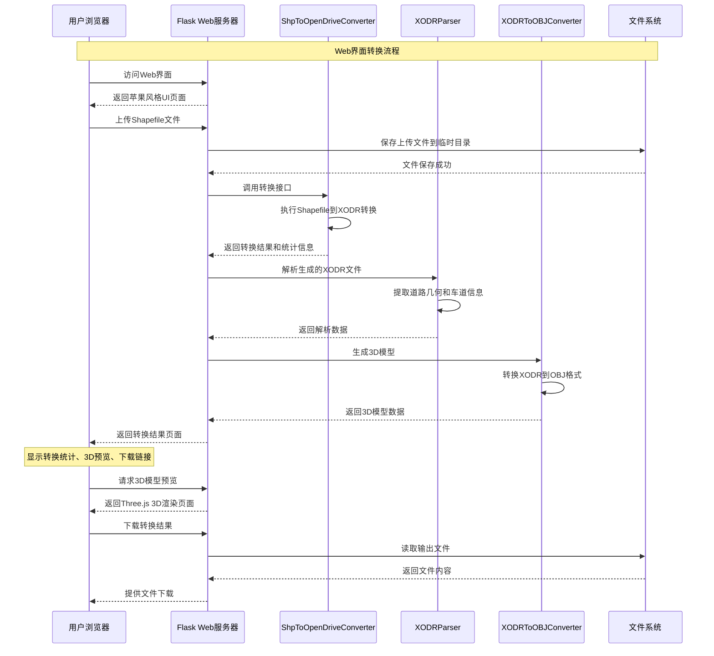
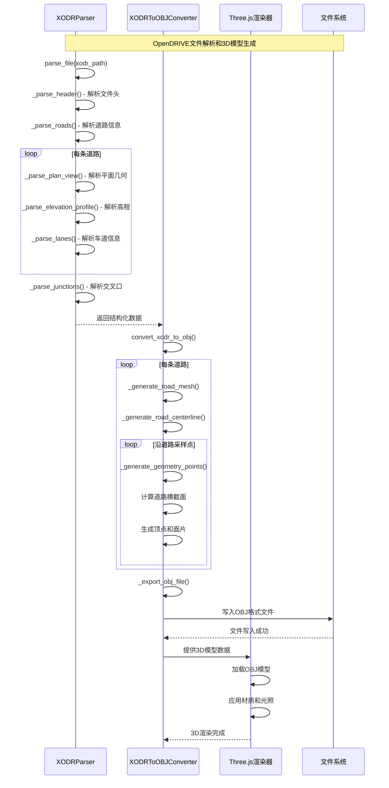
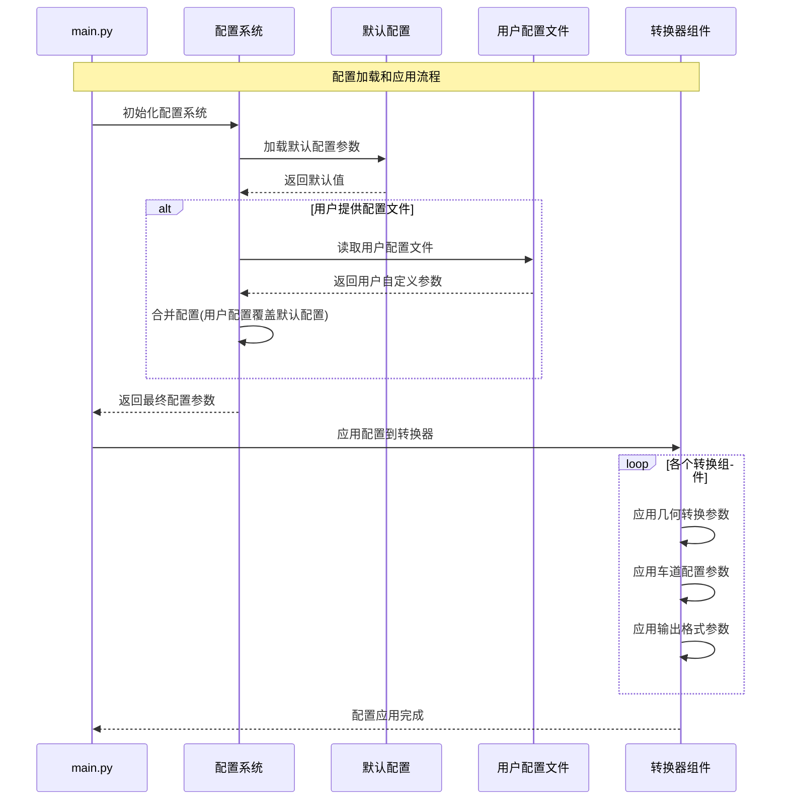

# ShpToOpenDrive 序列图

本文档展示了 ShpToOpenDrive 项目从 Shapefile 到 OpenDRIVE 转换的完整流程。

## 主要转换流程序列图



## 车道面处理详细流程



## 几何转换详细流程



## 文件生成流程



## 边界线处理详细流程 (v1.3.0新增)

```mermaid
sequenceDiagram
    participant Reader as ShapefileReader
    participant Generator as OpenDriveGenerator
    participant Converter as GeometryConverter

    Note over Reader,Converter: 边界线到planview参考线的转换流程
    
    Reader->>Reader: extract_lane_geometries()
    Reader->>Reader: 按RoadID分组边界线数据
    
    loop 每个RoadID
        Reader->>Reader: 按Index字段排序边界线
        Reader->>Reader: _build_lanes_from_boundaries()
        
        loop i = 0 to len(boundaries)-2
            Reader->>Reader: 取相邻边界线[i]和[i+1]
            Reader->>Reader: 构建车道面{surface_id, left_boundary, right_boundary}
            Reader->>Reader: _calculate_center_line(left_coords, right_coords)
            Reader->>Reader: _calculate_width_profile(left_coords, right_coords)
            Reader->>Reader: _merge_boundary_attributes(left_attrs, right_attrs)
        end
    end
    
    Reader-->>Generator: lane_surfaces数据
    
    Generator->>Generator: _calculate_road_reference_line(lane_surfaces)
    
    Note over Generator: 查找index='0'的边界线策略
    
    loop 遍历所有车道面
        alt left_boundary.index == '0'
            Generator->>Generator: reference_coords = left_boundary.coordinates
            Note over Generator: 找到index='0'的左边界，优先使用
            break
        else right_boundary.index == '0'
            Generator->>Generator: reference_coords = right_boundary.coordinates
            Note over Generator: 找到index='0'的右边界，次选使用
            break
        end
    end
    
    alt reference_coords为空
        Generator->>Generator: 使用第一个车道面的center_line
        Note over Generator: 回退方案1：使用中心线
        alt center_line不存在
            Generator->>Generator: _calculate_center_line_coords()
            Note over Generator: 回退方案2：动态计算中心线
        end
    end
    
    Generator->>Converter: convert_road_geometry(reference_coords)
    Converter->>Converter: 坐标序列转换为几何段
    Converter-->>Generator: 标准化几何段列表
    
    Generator-->>Generator: planview参考线几何段
```

## 关键组件说明

### ShpToOpenDriveConverter (主控制器)
- 协调整个转换流程
- 管理配置参数和转换统计
- 处理不同格式的输入数据
- 支持Lane.shp和传统道路格式的自动识别

### ShapefileReader (数据读取)
- 读取和解析Shapefile文件
- 坐标系转换(WGS84 → UTM → 局部坐标)
- 数据预处理和过滤
- **新增**: 边界线处理和车道面构建功能
- **新增**: Lane.shp格式的自动检测和处理

### GeometryConverter (几何转换)
- 离散点到参数化几何的转换
- 直线和圆弧拟合算法
- 几何连续性验证
- **新增**: 车道面几何转换和中心线计算

### OpenDriveGenerator (文件生成)
- OpenDRIVE标准格式生成
- 车道面和变宽车道处理
- XML文件输出和验证
- **新增**: 基于边界线index的planview参考线计算
- **新增**: 支持index='0'边界线作为道路参考线

## Web前端交互流程 (v1.3.0新增)



## XODR解析和3D转换流程 (v1.3.0新增)



## 配置文件处理流程 (v1.3.0新增)



## 支持的数据格式

1. **传统道路格式**: 包含道路中心线的标准shapefile
2. **Lane.shp格式**: 包含车道边界线的详细车道数据，支持变宽车道面
3. **OpenDRIVE格式**: 标准XODR文件，支持解析和3D转换
4. **OBJ 3D模型**: 用于可视化的三维网格模型

## 输出特性

- 符合OpenDRIVE 1.7标准
- 支持复杂几何(直线、圆弧)
- 支持变宽车道建模
- 包含完整的车道信息和道路标记
- 自动验证和统计报告
- **新增**: 3D模型导出和Web可视化
- **新增**: 实时转换进度和状态反馈
- **新增**: 苹果风格的现代化用户界面