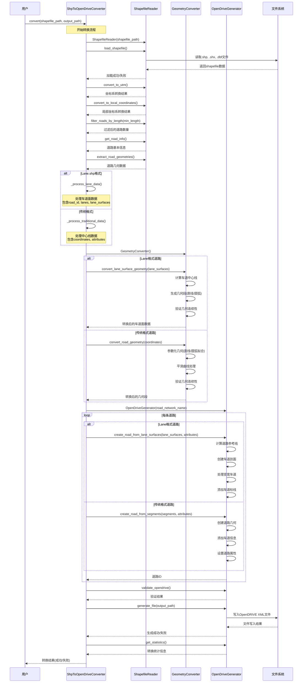
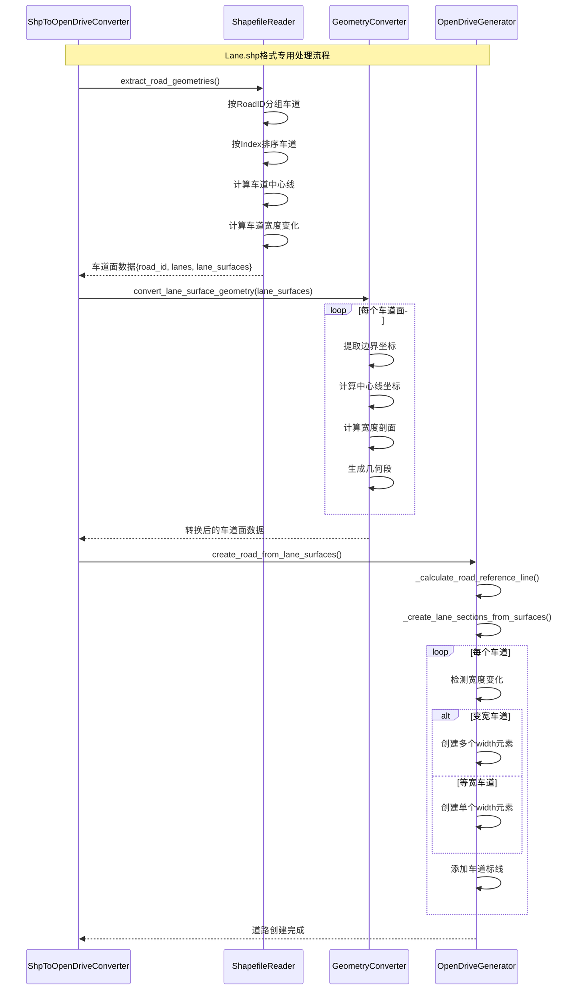
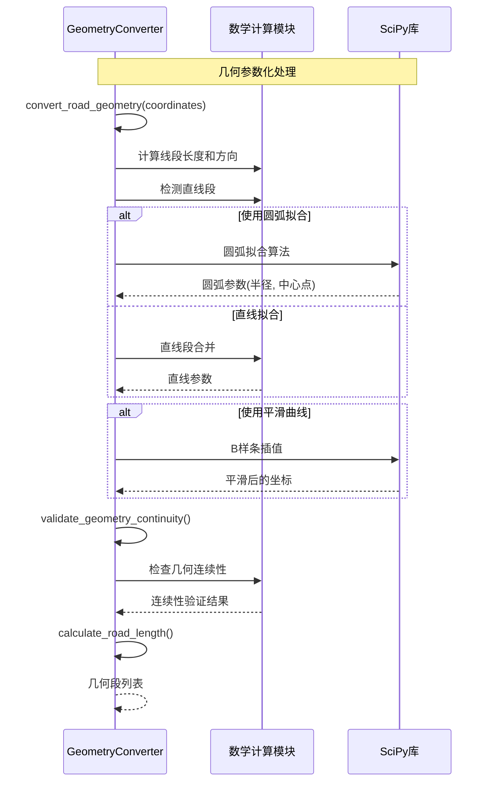
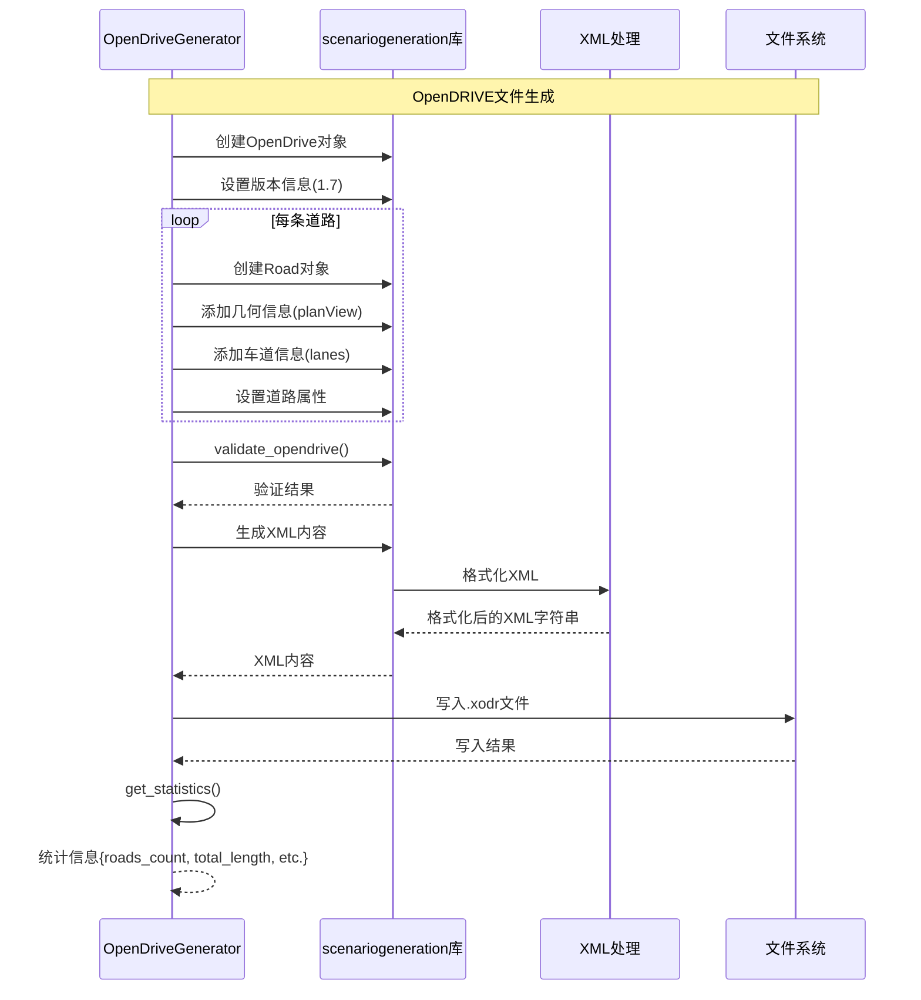

# ShpToOpenDrive 序列图

本文档展示了 ShpToOpenDrive 项目从 Shapefile 到 OpenDRIVE 转换的完整流程。

## 主要转换流程序列图

## 车道面处理详细流程

## 几何转换详细流程

## 文件生成流程

## 关键组件说明

### ShpToOpenDriveConverter (主控制器)
- 协调整个转换流程
- 管理配置参数和转换统计
- 处理不同格式的输入数据

### ShapefileReader (数据读取)
- 读取和解析Shapefile文件
- 坐标系转换(WGS84 → UTM → 局部坐标)
- 数据预处理和过滤

### GeometryConverter (几何转换)
- 离散点到参数化几何的转换
- 直线和圆弧拟合算法
- 几何连续性验证

### OpenDriveGenerator (文件生成)
- OpenDRIVE标准格式生成
- 车道面和变宽车道处理
- XML文件输出和验证

## 支持的数据格式

1. **传统道路格式**: 包含道路中心线的标准shapefile
2. **Lane.shp格式**: 包含车道边界线的详细车道数据，支持变宽车道面

## 输出特性

- 符合OpenDRIVE 1.7标准
- 支持复杂几何(直线、圆弧)
- 支持变宽车道建模
- 包含完整的车道信息和道路标记
- 自动验证和统计报告